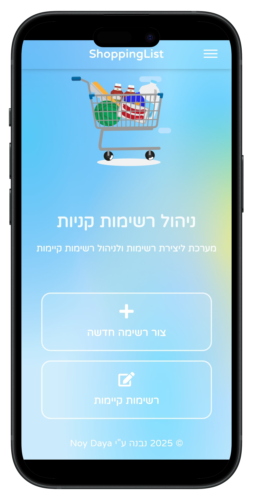
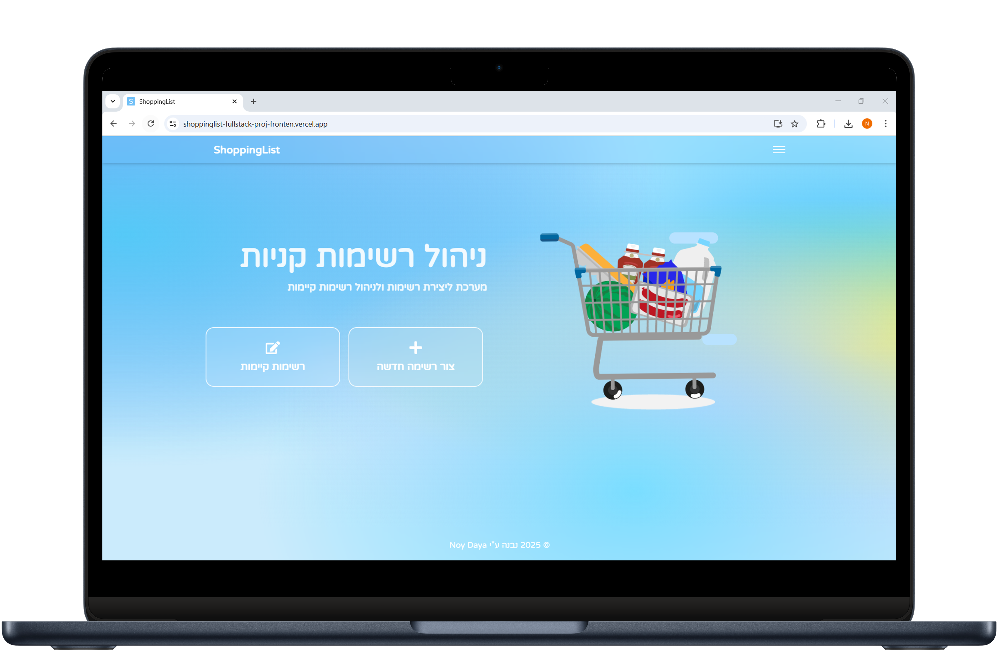
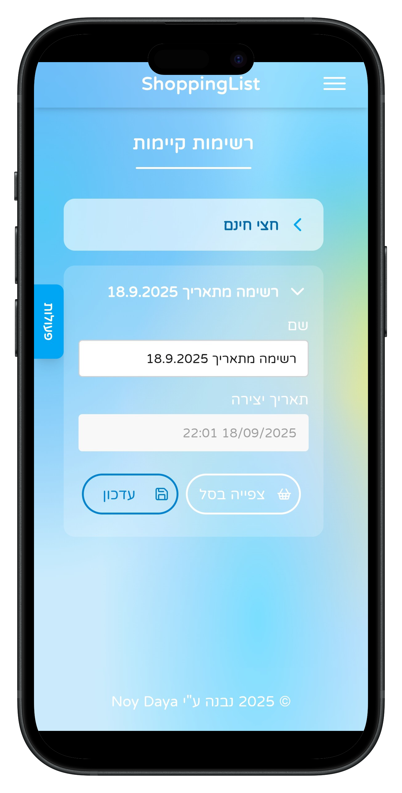
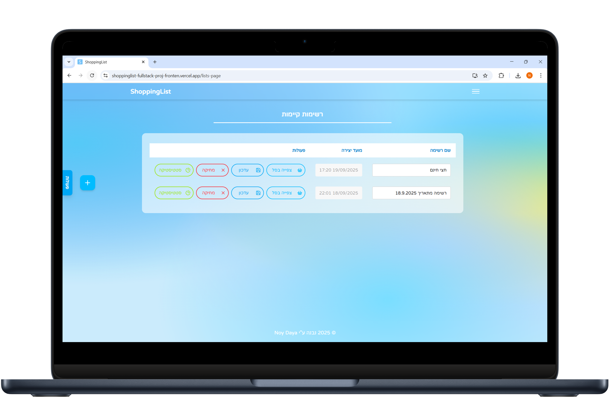
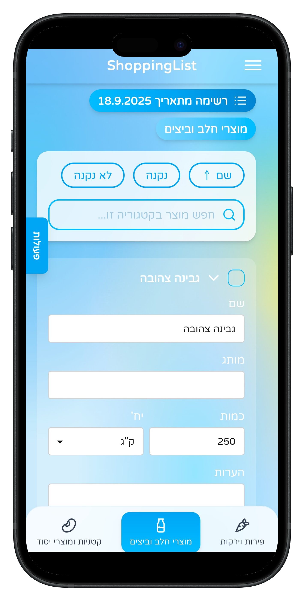
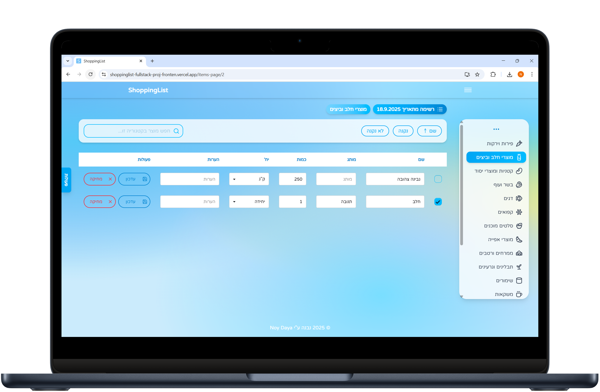
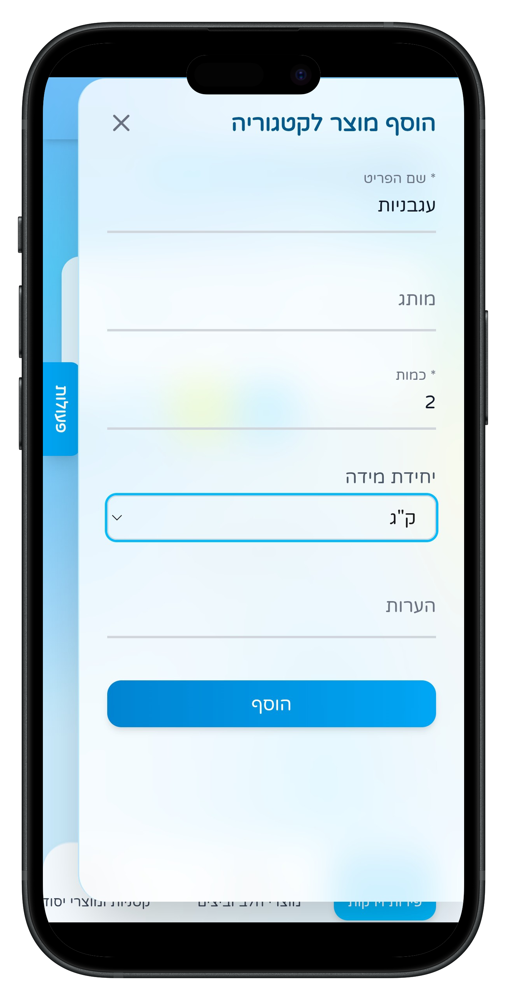
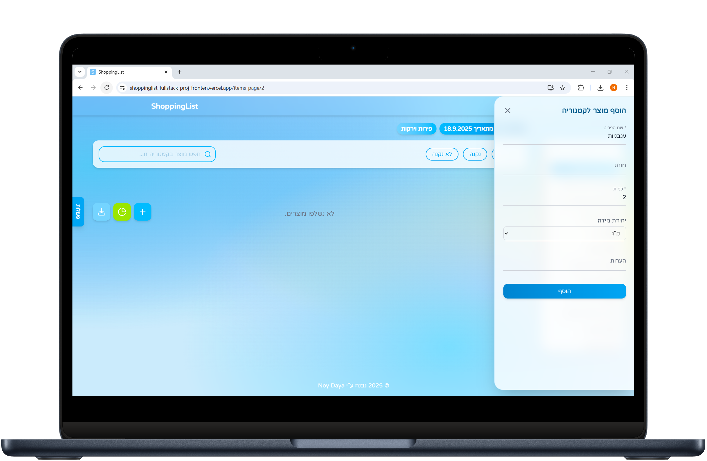
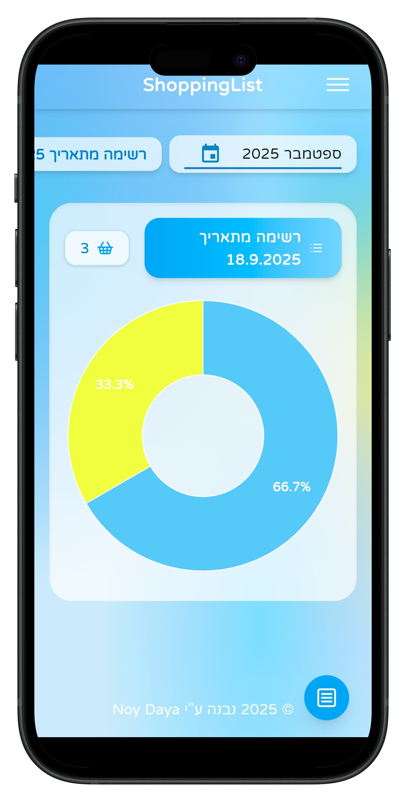
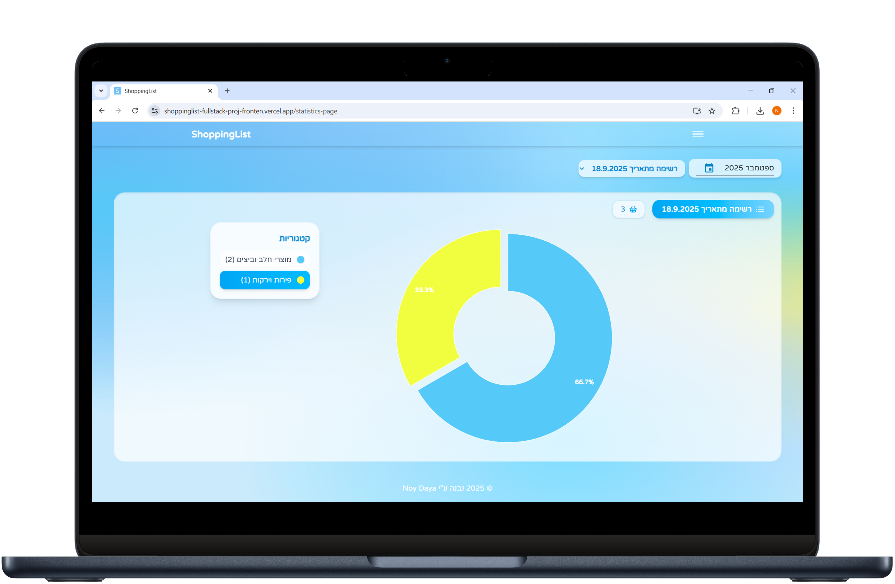

# 🛒 Shopping List API (Fullstack Project)

This is a **fullstack shopping list application** that allows users to easily create, manage, and organize their shopping lists.  

The app provides a **modern, responsive, and user-friendly interface** that works seamlessly on both **desktop and mobile devices**, ensuring a smooth experience regardless of screen size.  

### Features:
- **User-friendly UI**: Intuitive interface for adding, editing, and deleting items.
- **Real-time updates**: Powered by Supabase Realtime, allowing multiple users to see changes instantly.
- **Modern tech stack**: 
  - **Backend**: Node.js, Express, Prisma, PostgreSQL
  - **Frontend**: React, Vite, Tailwind CSS
- **Secure data handling**: Environment variables for API keys and database credentials.
- **Scalable structure**: Clean project organization with separate backend and frontend folders.
- **Cross-platform compatibility**: Optimized for both desktop browsers and mobile devices.

## 📖 Table of Contents

- [⚙️ Technologies](#-technologies)
  - [Backend](#backend)
  - [Frontend](#frontend)
- [📂 Project Main Structure](#-project-main-structure)
- [📷 Screenshots](#-screenshots)
- [🚀 Run Locally](#-run-locally)
  - [Clone repository](#1-clone-repository)
  - [Install dependencies](#2-install-dependencies)
  - [Install backend and frontend dependencies](#3-install-backend-and-frontend-dependencies)
  - [Create .env files](#4-create-env-files)
  - [Run both backend and frontend](#5-run-both-backend-and-frontend)
- [🌐 Live Demo](#-live-demo)

---
## ⚙️ Technologies
### Backend


The backend of the Shopping List application is designed to provide a **robust, scalable, and secure API** for the frontend. It uses the following technologies:
- **Node.js & Express** → REST API server
- **Prisma ORM** → Database access
- **Supabase (PostgreSQL)** → Managed database hosting
- **Middleware** → Async error handling, request validation, error handler

> 🔗 More detailed information is available in the [Backend README](./backend/README.md)

### Frontend


The frontend of the Shopping List application provides a **responsive and user-friendly interface**. It uses the following technologies:
- **React** → Component-based UI library for building interactive interfaces  
- **Vite** → Fast development server and build tool  
- **Tailwind CSS** → Utility-first CSS framework for rapid and responsive styling  
- **daisyUI** → Tailwind-based component library for pre-designed UI elements  

> 🔗 More detailed information is available in the [Frontend README](./frontend/README.md)

---

## 📂 Project Main Structure
```text
shopping-list-api/
├── backend/  # API
└── frontend/ # UI
```
> 💡 Note: Both `backend` and `frontend` folders include their own README files with detailed information.

---

## 📷 Screenshots

Here’s how the Shopping List App looks across mobile and desktop devices:

<table>
  <tr>
    <th>Page</th>
    <th>Mobile View</th>
    <th>Desktop View</th>
  </tr>
  <tr>
    <td>Main Dashboard</td>
    <td></td>
    <td></td>
  </tr>
  <tr>
    <td>Lists</td>
    <td></td>
    <td></td>
  </tr>
  <tr>
    <td>Items</td>
    <td></td>
    <td></td>
  </tr>
  <tr>
    <td>Add Item</td>
    <td></td>
    <td></td>
  </tr>
  <tr>
    <td>Statistics</td>
    <td></td>
    <td></td>
  </tr>
</table>

---

## 🚀 Run Locally

### 1. Clone repository
```bash
git clone https://github.com/your-username/shopping-list-api.git
cd shopping-list-api
```

### 2. Install dependencies
Install _concurrently_ (if not already installed globally):
```bash
npm install concurrently
```

### 3. Install backend and frontend dependencies:
```bash
cd backend && npm install
cd ../frontend && npm install
```
### 4. Create .env files
**Backend:** `backend/.env`
```.env
# PostgreSQL database connection URL
DATABASE_URL=your-database-url
```

**Frontend:** `frontend/.env`
```.env
# Backend API URL
VITE_APP_API_URL=your-backend-url
# Your Supabase Realtime URL (for real-time synchronization)
VITE_SUPABASE_URL=your-supabase-url
# Your Supabase anonymous key (for secure API calls)
VITE_SUPABASE_ANON_KEY=your-supabase-anon-key
```

### 5. Run both backend and frontend:
```bash
npm run dev
```

> This will start:   
Backend → http://localhost:3000   
Frontend → http://localhost:5173   

---

## 🌐 Live Demo

Check out the live version of the **Shopping List App** without installing anything locally:

[View Live Demo](https://shoppinglist-fullstack-proj-fronten.vercel.app/)

> The app works seamlessly on both desktop and mobile devices, providing a modern and responsive interface for managing your shopping lists.


