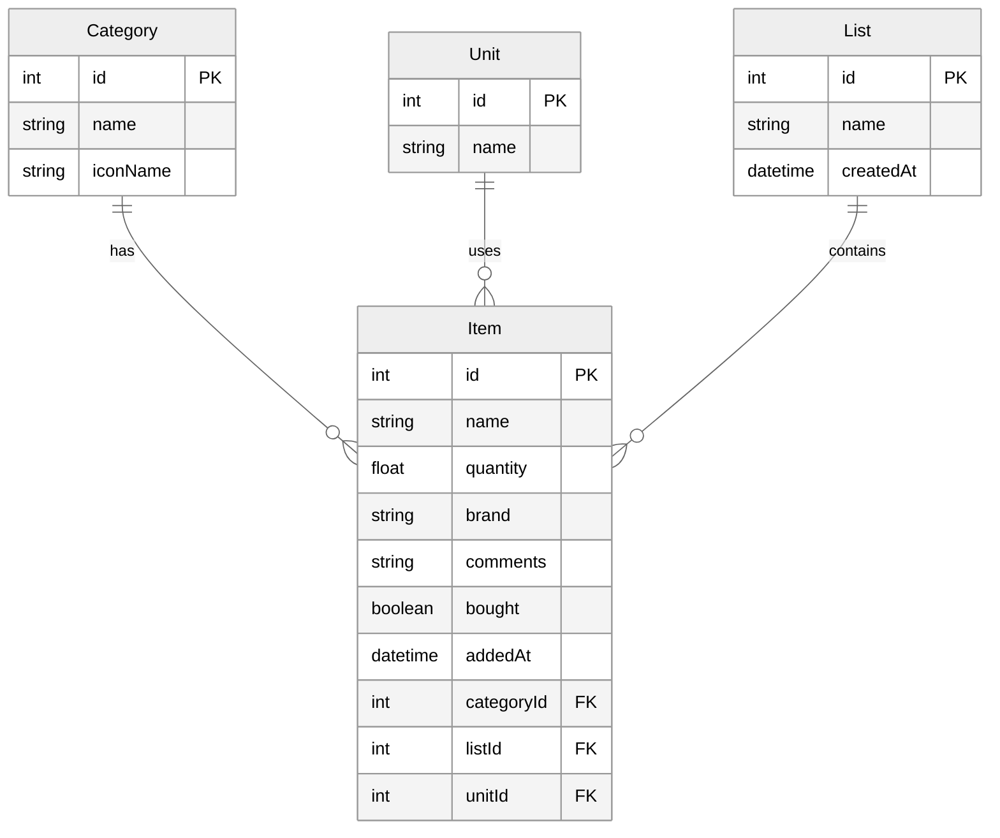
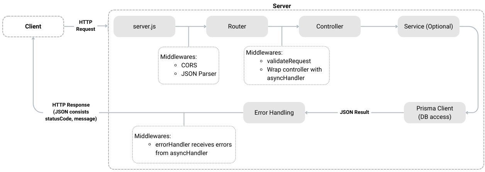

# Shopping List API – Backend

This is the backend of the **Shopping List App**, built with **Node.js, Express, Prisma, and Supabase**.  
It exposes a RESTful API for managing lists, items, categories, units, and statistics.

## 📖 Table of Contents

- [🛠️ Tech Stack](#-tech-stack)
- [🗄️ Database Structure](#-database-structure)
- [📂 Folder Structure](#-folder-structure)
- [🌐 API Endpoints](#-api-endpoints)
- [⚠️ Error Handling, Middleware & Validation](#-error-handling-middleware--validation)
- [🔄 Request Flow – Shopping List API](#-request-flow--shopping-list-api)
- [🚀 Run Locally](#-run-locally)

---

## 🛠️ Tech Stack


The backend of the Shopping List application is designed to provide a **robust, scalable, and secure API** for the frontend. It uses the following technologies:

- **Node.js & Express** – A fast and flexible JavaScript runtime and framework for building the REST API server. Express handles routing, middleware, and API endpoints efficiently, allowing the frontend to fetch, create, update, and delete data.

- **Prisma ORM** – A modern Object-Relational Mapping (ORM) tool that simplifies database access. Prisma provides type-safe queries, migrations, and an intuitive API for interacting with the PostgreSQL database.

- **Supabase (PostgreSQL)** – A fully managed PostgreSQL database with real-time capabilities. Supabase ensures data persistence, reliability, and scalability, while also enabling real-time updates for multiple users.

- **Custom middlewares**
  - **Async error handling** – Ensures uncaught errors in asynchronous functions are properly handled.  
  - **Request validation** – Validates incoming requests to maintain data integrity.  
  - **Global error handler** – Sends consistent error responses to the client while logging details for debugging.

---

## 🗄️ Database Structure

The backend uses **PostgreSQL** managed via **Prisma ORM**. Below is the Prisma schema defining the database models and their relations:




---

## 📂 Folder Structure
```text
backend/
├── controllers/    # Route controllers
├── middleware/     # Middlewares (asyncHandler, validateRequest, error handler)
├── prisma/         # Prisma client + schema
├── routes/         # Express route definitions
├── services/       # Reusable domain services (e.g., statistics calculations)
├── validators/     # validation methods
├── app.js          # Express app configuration
├── server.js       # Server entry point
```

---

## 🌐 API Endpoints

| Resource     | Method | Path                                        | Purpose                                   |
|--------------|--------|---------------------------------------------|-------------------------------------------|
| **Lists**    | POST   | `/api/lists`                               | Create new list                           |
|              | GET    | `/api/lists`                               | Get all lists                             |
|              | PUT    | `/api/lists/:id`                           | Update list name                          |
|              | DELETE | `/api/lists/:id`                           | Delete list and its items                 |
| **Items**    | POST   | `/api/lists/:listId/categories/:categoryId/items` | Add item to list+category         |
|              | GET    | `/api/lists/:listId/categories/:categoryId/items` | Get items for list+category       |
|              | PUT    | `/api/items/:id`                           | Update item (fields)                      |
|              | PATCH  | `/api/items/:id`                           | Update item "bought" status               |
|              | DELETE | `/api/items/:id`                           | Delete item                               |
| **Categories** | GET  | `/api/categories`                          | Get all categories                        |
| **Units**    | GET    | `/api/units`                               | Get all measurement units                 |
| **Statistics** | GET  | `/api/statistics/monthly?month=YYYY-MM`    | Monthly statistics (lists + items)        |
|              | GET    | `/api/statistics/list/:id`                 | Statistics for single list                |

---

## ⚠️ Error Handling, Middleware & Validation
The backend uses several middleware functions and validators to ensure **secure, consistent, and error-free API operations**:

- **CORS & JSON Parser**  
  Applied globally in `server.js` to handle cross-origin requests and parse incoming JSON payloads.

- **Validation Middleware (`validateRequest`)**  
  Ensures that request bodies and query parameters comply with defined validation rules.

- **Async Handler (`asyncHandler`)**  
  Wraps asynchronous controller functions to automatically catch errors and pass them to the global error handler.

- **Error Handler (`errorHandler`)**  
  Global middleware for handling errors and sending uniform JSON responses to the client.

- **Validators**  
  - `listValidator.js` → Validates list creation and updating requests  
  - `itemValidator.js` → Validates item creation and updating requests

---

## 🔄 Request Flow – Shopping List API

Each request to the Shopping List API follows a structured flow from frontend to database and back. This ensures proper validation, error handling, and separation of concerns.



### 1. Frontend
- Sends HTTP requests (`GET`, `POST`, `PUT`, `DELETE`) with data in `body`, `params`, or `query`.

### 2. Express Server (`server.js`)
- Runs **global middleware**:
  - **CORS** → Allows frontend requests.
  - **JSON Parser** → Parses `req.body`.

### 3. Router (per resource)
- Defines endpoints for resources like `lists`, `items`, `categories`, `units`, `statistics`.
- Attaches **route-specific middleware**:
  - **`validateRequest`** → Validates request data.
  - **`asyncHandler`** → Wraps controllers to catch asynchronous errors and forward them to `errorHandler`.

### 4. Controller
- Handles the request and executes business logic:
  - CRUD operations: Create, Read, Update, Delete.
  - Optionally calls the **Service Layer** for complex operations, e.g., statistics calculations.

### 5. Service Layer (optional)
- Contains shared domain logic or complex calculations.
- Helps separate business logic from controllers, primarily used for **statistics**.

### 6. Prisma Client
- Interacts with the database (Supabase):
  - `prisma.list.findMany()`
  - `prisma.item.create()`
  - `prisma.category.findMany()`
  - `prisma.item.update()`

### 7. Response
- Returns JSON data to the frontend.

### 8. Error Handling
- Any error in middleware, controller, service, or Prisma is caught by **`errorHandler`**:
  - Returns a consistent JSON response with:
    - `statusCode`
    - `message`

**Notes:**
- **Validation Layer:** Runs before controllers.  
- **AsyncHandler:** Wraps controllers to forward async errors to `errorHandler`.  
- **Service Layer:** Handles complex logic (optional).  
- **ErrorHandler:** Unified JSON error responses for all layers.

---

## 🚀 Run Locally

### 1. Install dependencies:
```bash
cd backend
npm install
```

### 2. Create .env file
`backend/.env`
```.env
# PostgreSQL database connection URL (provided by Supabase)
DATABASE_URL=your-database-url
```

### 3. Run
```bash
npm run dev
```

> This will start: Backend → http://localhost:3000   

---
